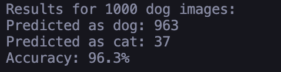

# CNN Image Classification - Cat vs Dog Detector

## Overview

This project implements a Convolutional Neural Network (CNN) using TensorFlow/Keras to classify images of cats and dogs. The model achieves a 96.3% accuracy on the test dataset, demonstrating high reliability in distinguishing between cat and dog images.

## Dataset

You can download the dataset from [Google Drive](https://drive.google.com/drive/folders/14WzYW03GJu4rvOdo7sXIADHdq9DVgS1o). The dataset contains:

- 4000 cat images and 4000 dog images for training
- 1000 cat images and 1000 dog images for testing

## Project Structure

```
dataset/
├── training_set/
│   ├── cats/    # 4000 images
│   └── dogs/    # 4000 images
└── test_set/
    ├── cats/    # 1000 images
    └── dogs/    # 1000 images
```

## Features

- Image classification using CNN architecture
- Data augmentation for improved model robustness
- Binary classification (Cat vs Dog)
- Real-time prediction capabilities

## Technical Details

### Model Architecture

- Input Layer: 128x128x3 (RGB images)
- 2 Convolutional Layers with:
  - 32 filters each
  - 3x3 kernel size
  - ReLU activation
- 2 MaxPooling Layers (2x2)
- Flatten Layer
- Dense Layer (128 units, ReLU)
- Output Layer (1 unit, Sigmoid)

### Training Parameters

- Optimizer: Adam
- Loss Function: Binary Cross-Entropy
- Batch Size: 32
- Epochs: 50
- Dataset Split: 80% training (8000 images), 20% testing (2000 images)

### Data Augmentation

- Rescaling: 1/255
- Shear Range: 0.2
- Zoom Range: 0.2
- Horizontal Flip: Enabled

## Performance

- Test Accuracy: 96.3%
- False Positives: 37 out of 1000
- True Positives: 963 out of 1000

## Requirements

- Python 3.10
- TensorFlow
- Numpy
- Pillow
- SciPy
- Matplotlib

## Installation

```bash
# Create virtual environment
python -m venv myenv
source myenv/bin/activate  # For Mac/Linux
.\myenv\Scripts\activate   # For Windows

# Install dependencies
pip install tensorflow numpy pillow scipy matplotlib
```

## Usage

```python
python CNN_Image_Classification.py
```

## Results

The model demonstrates excellent performance in distinguishing between cats and dogs:

- Successfully identified 963 dogs out of 1000 test images
- Only 37 misclassifications
- Achieved 96.3% accuracy on the test dataset



## Credits

- Dataset source: [Cat and Dog Dataset (Google Drive)](https://drive.google.com/drive/folders/14WzYW03GJu4rvOdo7sXIADHdq9DVgS1o)
- Based on tutorial from [Mega Bagus Website](https://www.megabagus.id/deep-learning-convolutional-neural-networks-aplikasi/)

## References

1. Original tutorial: [Deep Learning: Convolutional Neural Networks (Aplikasi)](https://www.megabagus.id/deep-learning-convolutional-neural-networks-aplikasi/)
